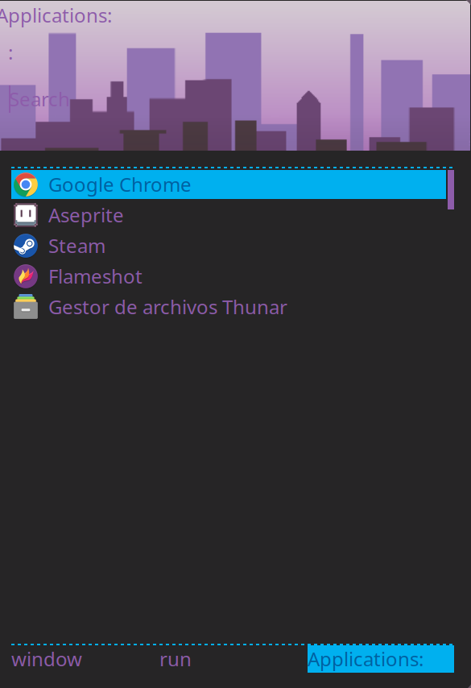

# 🌸 Rofi Config

This is my [Rofi](https://github.com/davatorium/rofi) setup for Linux.  
Minimal, fast, and with a personal touch ✨.

## 📂 Contents
- `config.rasi` → main configuration file  
- `themes/` → custom themes  



## 🚀 Usage
1. Clone this repo:
   ```bash
   git clone git@github.com:your-username/rofi-config.git
   ```

---

## 📜 License for Assets
- Configuration files: **MIT**  
- Included image (made in Inkscape): **CC BY 4.0**  
  [https://creativecommons.org/licenses/by/4.0/](https://creativecommons.org/licenses/by/4.0/)

---

## 📜 Note
This repository only contains my personal configuration for Rofi.  
Rofi is an independent project distributed under the **GPL-3.0 License**.  
For more info: [https://github.com/davatorium/rofi](https://github.com/davatorium/rofi)

---

# Neovim Config

Personal Neovim configuration optimized for **web development, TypeScript, React/Next.js, and Lua**.  
Includes modern plugins for **LSP, completion, snippets, Telescope, UI enhancements, and Git integration**.

---

## ✨ Features

- **LSP** via [nvim-lspconfig](https://github.com/neovim/nvim-lspconfig) (preconfigured for TypeScript).
- **Completion** with [nvim-cmp](https://github.com/hrsh7th/nvim-cmp), Copilot, buffer, path, and cmdline sources.
- **Snippets** powered by [LuaSnip](https://github.com/L3MON4D3/LuaSnip).
- **UI/UX**:  
  - [tokyonight](https://github.com/folke/tokyonight.nvim) colorscheme  
  - [lualine](https://github.com/nvim-lualine/lualine.nvim) statusline  
  - [alpha-nvim](https://github.com/goolord/alpha-nvim) dashboard  
  - [nvim-notify](https://github.com/rcarriga/nvim-notify) notifications  
  - [noice.nvim](https://github.com/folke/noice.nvim) enhanced cmdline & UI
- **File navigation** with [NERDTree](https://github.com/preservim/nerdtree) and [telescope.nvim](https://github.com/nvim-telescope/telescope.nvim).
- **Git integration** with [vim-gitbranch](https://github.com/itchyny/vim-gitbranch).
- **React/Next.js abbreviations** for faster coding (e.g. `usee-` → `useEffect(() => {}, [])`).
- **Indent guides** with [indent-blankline.nvim](https://github.com/lukas-reineke/indent-blankline.nvim).

---

## 📦 Requirements

- **Neovim** >= 0.8  
- **Node.js** (for Copilot and some plugins)  
- **Yarn** (for React snippets plugin build step)  
- **ripgrep** (for Telescope live grep)  
- **zsh** (set as default shell in config)  

---

## 🚀 Installation

1. Install [vim-plug](https://github.com/junegunn/vim-plug) if not already installed.  
2. Clone this repo into your Neovim config folder:
   ```bash
   git clone https://github.com/your-username/nvim-config ~/.config/nvim
   ```
3. Open Neovim and run:
   ```vim
   :PlugInstall
   ```
4. Update Treesitter parsers:
   ```vim
   :TSUpdate
   ```

